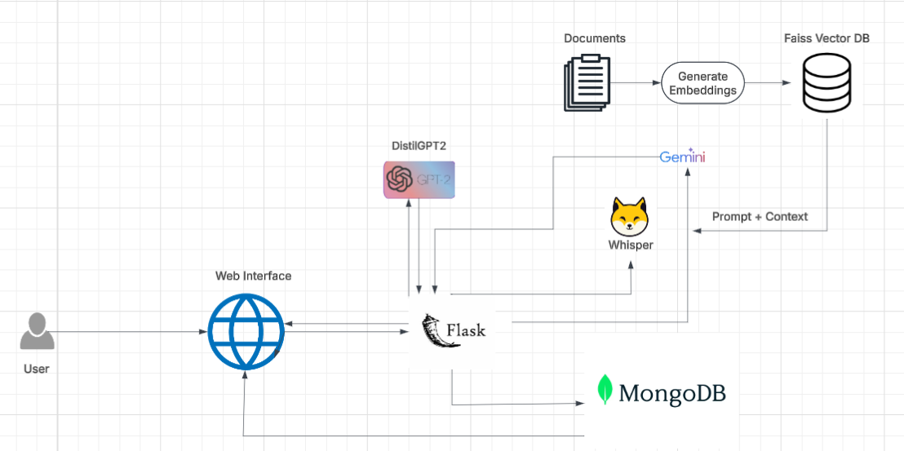

# Language Learning Application for Moroccan Primary Students

## Overview
This is a Flask-based web application designed to help Moroccan primary school students practice French reading and pronunciation. The app allows users to retrieve random texts based on levels and difficulties, record their readings, and receive detailed pedagogical feedback using AI-driven audio analysis and natural language processing. It is tailored to the Moroccan educational context, ensuring privacy with local processing and providing culturally relevant feedback.

- **Target Audience**: Moroccan primary students (e.g., level 6).
- **Language**: French.
- **Key Features**: Text retrieval, audio upload, pronunciation scoring, text accuracy evaluation, and personalized feedback.

## Installation

### Prerequisites
- Python 3.8 or higher.
- MongoDB (local or cloud instance).
- Internet connection (for API calls and initial model downloads).

### Setup Instructions
1. **Clone the Repository**:
   ```bash
   git clone https://github.com/NextGenEduMA/LectureEval-FR-ver.git
   cd  LectureEval-FR-ver
   ```

2. **Create a Virtual Environment**:
   ```bash
   python -m venv venv
   source venv/bin/activate  # On Windows: venv\Scripts\activate
   ```

3. **Install Dependencies**:
   ```bash
   pip install -r requirements.txt
   ```
   *Note*: Create a `requirements.txt` file with the following content:
   ```
   flask
   pymongo
   librosa
   pydub
   soundfile
   gtts
   transformers
   torch
   fastdtw
   jiwer
   python-dotenv
   requests
   ```

4. **Configure Environment Variables**:
   - Create a `.env` file in the root directory:
     ```
     HF_TOKEN=your_huggingface_token
     GEMINI_API_KEY=your_google_api_key
     MONGO_URI=mongodb://localhost:27017
     ```
   - Replace placeholders with your actual API keys and MongoDB URI.

5. **Set Up MongoDB**:
   - Install MongoDB locally or use a cloud service (e.g., MongoDB Atlas).
   - Create a database `language_learning` and a collection `texts` with sample data (e.g., French texts with `id`, `content`, `language`, `level`, `difficulty`).

6. **Initialize File Structure**:
   - Create directories: `Uploads/`, `static/audio/`, `reference_audio/`, and `templates/`.
   - Add an `index.html` file in `templates/` for the web interface.

7. **Run the Application**:
   ```bash
   python app.py
   ```
   - Access the app at `http://localhost:5000`.

## Usage
1. **Get a Random Text**:
   - Visit `/get_random_text?language=fr&level=6&difficulty=medium` to retrieve a text.
2. **Generate Reference Audio**:
   - Use `/text-to-speech` with a JSON payload (e.g., `{"text": "Les élèves préparent un spectacle.", "language": "fr"}`) to get an audio URL.
3. **Evaluate Pronunciation**:
   - Upload an audio file via `/evaluate` with form data (`reference_text`, `text_id`, `language`, `level`, `difficulty`).
   - Receive a JSON response with scores, transcription, and feedback.
4. **View Feedback**:
   - The web interface displays pronunciation accuracy, text accuracy, reading speed, and pedagogical tips.

## Technical Stack
- **Framework**: Flask (Python web framework).
- **Database**: MongoDB (NoSQL for text storage).
- **Audio Processing**: Librosa (feature extraction), Pydub (audio conversion), Soundfile (duration), gTTS (text-to-speech).
- **AI and Analysis**: 
  - Transformers (Hugging Face) for Whisper (speech-to-text) and DistilGPT2 (fallback feedback).
  - FastDTW (pronunciation scoring).
  - Jiwer (text accuracy metrics).
  - Google Generative Language API (Gemini-1.5-Flash for feedback).
- **Utilities**: Dotenv (environment variables), Threading (parallel processing), OS/Tempfile/UUID (file management).
- **RAG**: Custom RAGRetriever for context-specific pedagogical tips.

## Architecture


*Description*: The architecture includes a Flask server as the central hub, interacting with a MongoDB database for text storage, an audio processing pipeline (Librosa, Pydub, Soundfile, gTTS), and an AI pipeline (Whisper, Jiwer, FastDTW, Gemini, DistilGPT2). The RAGRetriever enhances feedback, and a file system manages audio files. Users access the system via a web interface.

## Contributing
1. Fork the repository.
2. Create a new branch: `git checkout -b feature-branch`.
3. Make your changes and commit: `git commit -m "Add new feature"`.
4. Push to the branch: `git push origin feature-branch`.
5. Submit a pull request.


